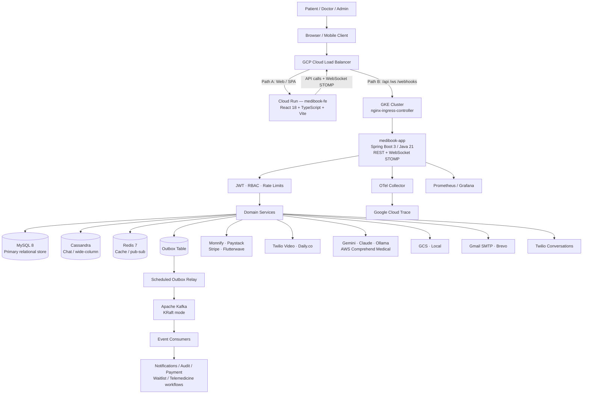

# MediBook

Production-grade healthcare appointment, consultation, telemedicine, billing, and patient engagement API built with Spring Boot.

## Overview

MediBook is a backend platform for digital healthcare operations. It supports patient registration, doctor discovery, appointment booking, consultation workflows, telemedicine sessions, payments, prescriptions, post-consultation surveys, waitlists, notifications, administrative reporting, and AI-assisted clinical/support workflows.

The repository is primarily a Spring Boot backend. It exposes a versioned REST API, WebSocket/STOMP notifications, Kafka-backed asynchronous processing (KRaft mode, no ZooKeeper), Flyway-managed relational schema migrations, Redis-backed cache/rate limiting, Cassandra-backed telemedicine chat storage, Docker Compose for local infrastructure, and Kubernetes/GKE manifests for deployment.

The frontend (`medibook-fe` — React 18 + TypeScript + Vite) is deployed separately as a Cloud Run service and is not part of this repository. The GKE cluster handles all API, WebSocket, and webhook traffic; web and SPA traffic is routed to Cloud Run by the GCP load balancer.

## Key Features

- Patient authentication, profile management, email verification, password reset, JWT access tokens, refresh-token rotation, and optional email OTP 2FA.
- Role-based access control for `PATIENT`, `DOCTOR`, `ADMIN`, and `SUPER_ADMIN`.
- Department and doctor management, doctor search, doctor working hours, availability grids, leave management, slot blocks, and recurring appointments.
- Appointment booking, temporary slot holds, cancellation, rescheduling, calendar export, status transitions, no-show handling, and automated lifecycle cleanup.
- Consultation notes, note templates, prescriptions, patient medical profile, and patient access grants for doctor access to health records.
- Telemedicine session lifecycle with provider abstraction — Twilio Video (active/production), Daily.co (alternative), and Stun (local development).
- Doctor-patient chat, Twilio Conversations webhook ingestion, AI summaries, AI draft responses, consent tracking, and urgency escalation.
- Payment initiation, verification, refunds, provider webhooks, invoice retrieval, and provider abstraction for Monnify (primary, Nigeria), Paystack (secondary, Nigeria), Stripe (international), and Flutterwave (optional).
- Admin analytics for appointments, revenue, doctor utilization, and daily capacity.
- Waitlist management with scheduled promotion after cancellations.
- Notification inbox with REST fallback and WebSocket/STOMP push.
- FHIR R4 read-only endpoints for patient, practitioner, appointment, and consultation observation data.
- AI support chat and clinical NLP provider abstractions — Google Gemini (active), Claude API (available), Ollama (self-hosted option), and AWS Comprehend Medical.
- PHI and field encryption helpers, audit logging, soft-delete recovery, correlation IDs, security headers, CORS allowlisting, and Redis-backed rate limiting.
- Production-oriented observability with Micrometer, Prometheus metrics, OpenTelemetry tracing, structured JSON logs, Grafana provisioning, and Kubernetes alert rules.

Partial or intentionally guarded areas:

- The repository does not contain frontend source code. The frontend (`medibook-fe`) is built and deployed separately to Cloud Run. Kubernetes manifests include a frontend deployment placeholder and runtime CORS/frontend URL configuration.
- AI and clinical NLP providers default to stub in local/dev configuration. Production startup validation refuses unsafe stub provider combinations.
- Telemedicine defaults to the Stun provider in local development. Twilio Video is the active production provider.

---

## Tech Stack

### Backend

- Java 21
- Spring Boot 3.3.13
- Spring Web MVC
- Spring WebSocket/STOMP
- Spring Security
- Spring Validation
- Spring AOP
- Spring Async and Scheduling
- Spring Actuator
- Lombok
- MapStruct

### Database

- MySQL 8.x as the primary relational datastore
- Spring Data JPA and Hibernate
- Flyway MySQL migrations in `src/main/resources/db/migration`
- Cassandra 4.1 for telemedicine chat message storage
- H2 for test profile execution

### Cache

- Redis 7.2
- Spring Cache with Redis-backed caches for doctors, departments, appointments, and doctor slots
- Redis-backed rate limiting
- Redis pub/sub for notification fan-out across backend replicas

### Messaging and Background Work

- Apache Kafka (KRaft mode — no ZooKeeper dependency)
- Spring Kafka
- Transactional outbox table and scheduled outbox relay
- Idempotent event processing via processed-event tracking
- ShedLock-backed scheduled jobs for multi-replica safety

### Authentication and Security

- JWT access tokens signed with JJWT
- Refresh-token rotation and session timeout filters
- BCrypt password hashing
- Email OTP based 2FA
- Method-level authorization with `@PreAuthorize`
- CORS allowlist
- CSP, HSTS, frame-denial, content-type, cache-control, and permissions-policy headers
- PHI encryption and general field encryption utilities
- OWASP Dependency-Check and Trivy configured in CI

### DevOps and Infrastructure

- Maven Wrapper
- Multi-stage Dockerfile using Maven and Eclipse Temurin Java 21
- Docker Compose local stack
- Kubernetes manifests for API, frontend placeholder, service, ingress, HPA, PDB, network policy, config map, and Prometheus rules
- GitHub Actions CI and GKE deployment workflows
- Google Artifact Registry and GKE deployment path in `.github/workflows/deploy.yml`
- Google Cloud Trace for distributed tracing in production

### Testing

- JUnit 5
- Spring Boot Test
- Spring Security Test
- Mockito
- Testcontainers for MySQL, Cassandra, and Kafka
- Spring Kafka Test
- JaCoCo coverage gate
- OpenAPI contract integration test
- Gatling simulation
- k6 load test script

### Observability

- Spring Boot Actuator
- Micrometer Prometheus registry
- Micrometer tracing bridge for OpenTelemetry (OTel SDK)
- OTLP exporter → OTel Collector (sidecar deployment: `otelemetry/otel-collector`)
- Logstash Logback encoder for JSON production logs
- Prometheus and Grafana local provisioning
- Google Cloud Trace integration for production tracing
- Kubernetes Prometheus alert rules
- Custom metrics for emergency, health, notification, token, outbox, and scheduled job behaviour

### External Integrations

#### Payment Gateways
| Provider | Role |
|---|---|
| Monnify | Primary (Nigeria) |
| Paystack | Secondary (Nigeria) |
| Stripe | International |
| Flutterwave | Optional |

Payment webhook callbacks return via the load balancer / ingress.

#### AI / LLM Providers
| Provider | Status |
|---|---|
| Google Gemini | Active |
| Anthropic Claude | Available |
| Ollama | Self-hosted option |
| AWS Comprehend Medical | Clinical NLP |

#### Telemedicine
| Provider | Status |
|---|---|
| Twilio Video | Active (production) |
| Daily.co | Alternative |
| Stun | Local development |

The backend issues tokens and creates rooms server-side; the browser/client uses the provider SDK directly to connect.

#### Email
| Provider | Role |
|---|---|
| Gmail SMTP | Primary |
| Brevo | Alternative |

#### Storage
| Provider | Role |
|---|---|
| Google Cloud Storage (GCS) | Primary |
| Local filesystem | Development / fallback |

#### Chat
- Twilio Conversations — chat webhook integration

---

## Architecture

MediBook follows a modular monolith architecture. Business capabilities are grouped under domain packages, each with controllers, DTOs, entities, repositories, and services. Synchronous requests enter through REST controllers or WebSocket endpoints. Durable state is stored in MySQL; high-volume telemedicine chat messages use Cassandra; cached and read-heavy paths use Redis; domain events are published to Kafka through a transactional outbox pattern.

### Infrastructure Topology

Inbound traffic is split at the GCP load balancer:

- **Path A — Web / SPA traffic** → Cloud Run (`medibook-fe`, React 18 + TypeScript + Vite). The frontend serves static assets; browsers then open WebSocket STOMP connections and call REST APIs via the load balancer.
- **Path B — `/api`, `/ws`, `/webhooks`** → GKE Cluster → nginx-ingress-controller → backend services.

The GKE cluster runs the backend deployment (`medibook-app`, Spring Boot 3 / Java 21), an OTel Collector sidecar, Kubernetes Secrets, ConfigMaps, and NetworkPolicies. The persistence layer is polyglot: MySQL 8 (primary relational store), Apache Cassandra (wide-column, chat persistence), Redis 7 (cache / ephemeral store / pub-sub), and Apache Kafka (event streaming).

The backend is provider-driven at the edges. Payment, video, AI, clinical NLP, mail, and object-storage integrations sit behind internal ports/adapters so local development uses lightweight stubs while production switches providers through configuration.



### Backend Module Map

| Path | Responsibility |
|---|---|
| `src/main/java/com/medibook/domain/user` | Authentication, users, profile, 2FA, password reset, refresh tokens |
| `src/main/java/com/medibook/domain/appointment` | Booking, holds, appointment lifecycle, transitions, pricing estimates |
| `src/main/java/com/medibook/domain/doctor` | Doctor profiles, search, working hours, schedules |
| `src/main/java/com/medibook/domain/department` | Public and admin department management |
| `src/main/java/com/medibook/domain/patient` | Patient profile, history, record access grants |
| `src/main/java/com/medibook/domain/consultation` | Consultation notes and clinical history |
| `src/main/java/com/medibook/domain/telemedicine` | Video sessions, calls, participants, chat |
| `src/main/java/com/medibook/chat` | Twilio Conversations, AI doctor-patient chat, consent, urgency alerts |
| `src/main/java/com/medibook/ai` | AI clients, support chat, prompt/safety/orchestration, audit |
| `src/main/java/com/medibook/domain/payment` | Payment providers, invoices, refunds, webhook processing |
| `src/main/java/com/medibook/domain/prescription` | Structured prescriptions |
| `src/main/java/com/medibook/domain/schedule` | Leave, holidays, slot blocks, recurring appointments, note templates |
| `src/main/java/com/medibook/domain/notification` | Notification inbox and read-state management |
| `src/main/java/com/medibook/domain/analytics` | Admin analytics and reporting |
| `src/main/java/com/medibook/domain/fhir` | Read-only FHIR R4 mappings |
| `src/main/java/com/medibook/messaging` | Kafka topics, events, producers, consumers, outbox relay |
| `src/main/java/com/medibook/jobs` | Scheduled lifecycle, cleanup, reminder, and waitlist jobs |
| `src/main/java/com/medibook/infrastructure` | Health checks, metrics, notification retry, storage providers, encryption |
| `src/main/java/com/medibook/security` | Security chain, JWT, filters, WebSocket auth |
| `src/main/resources/db/migration` | Flyway migrations (43 files) |

---

## API Surface

All business endpoints are versioned under `/api/v1` unless noted.

| Area | Representative endpoints |
|---|---|
| Authentication | `POST /api/v1/auth/register`, `POST /api/v1/auth/login`, `POST /api/v1/auth/refresh`, `POST /api/v1/auth/logout`, `POST /api/v1/auth/2fa/verify` |
| Current user | `GET /api/v1/me`, `PATCH /api/v1/me`, `POST /api/v1/me/avatar`, `POST /api/v1/me/password` |
| Departments | `GET /api/v1/departments`, `GET /api/v1/departments/{id}`, admin CRUD under `/api/v1/admin/departments` |
| Doctors | `GET /api/v1/doctors/search`, `GET /api/v1/doctors/{id}/availability`, admin lifecycle under `/api/v1/admin/doctors` |
| Appointments | `POST /api/v1/appointments`, `GET /api/v1/me/appointments`, `POST /api/v1/appointments/{id}/cancel`, `POST /api/v1/appointments/{id}/reschedule`, `POST /api/v1/appointments/{id}/transition` |
| Holds and recurring | `POST /api/v1/appointments/holds`, `POST /api/v1/appointments/recurring` |
| Payments | `GET /api/v1/payments/providers`, `POST /api/v1/payments`, `POST /api/v1/payments/{id}/verify`, `POST /api/v1/payments/webhooks/{provider}` |
| Invoices | `GET /api/v1/invoices/{id}`, `GET /api/v1/invoices/my` |
| Telemedicine | `POST /api/v1/telemedicine/sessions`, `POST /api/v1/telemedicine/sessions/{id}/token`, `POST /api/v1/telemedicine/sessions/{id}/join`, `POST /api/v1/telemedicine/sessions/{id}/end-call` |
| Chat and AI | `POST /api/v1/chat/conversations`, `POST /api/v1/chat/conversations/{id}/messages`, `POST /api/v1/chat/{conversationId}/ai/summary`, `POST /api/v1/ai/chat` |
| Clinical records | `POST /api/v1/consultation-notes/appointment/{appointmentId}`, `GET /api/v1/consultation-notes/my-history`, `POST /api/v1/prescriptions` |
| Admin | `/api/v1/admin/admins`, `/api/v1/admin/analytics`, `/api/v1/admin/soft-delete`, `/api/v1/admin/pricing-policy` |
| FHIR | `GET /api/v1/fhir/Patient/{id}`, `GET /api/v1/fhir/Practitioner/{id}`, `GET /api/v1/fhir/Appointment/{id}` |
| System | `GET /health`, `GET /health/live`, `GET /health/ready`, `GET /version`, Actuator health and Prometheus endpoints |

OpenAPI is available when enabled:

- Swagger UI: `http://localhost:8080/swagger-ui.html`
- OpenAPI JSON: `http://localhost:8080/api-docs`

Set `OPENAPI_ENABLED=true` in local development to expose the documentation endpoints.

---

## Authentication and Authorization

MediBook uses stateless JWT authentication with refresh-token rotation.

1. Patients self-register through `POST /api/v1/auth/register`.
2. Users authenticate with `POST /api/v1/auth/login`.
3. The API returns an access token, refresh token, token type, expiry, and user profile unless 2FA is enabled.
4. 2FA users complete login through `POST /api/v1/auth/2fa/verify`.
5. Access tokens are sent as `Authorization: Bearer <token>`.
6. Refresh tokens rotate through `POST /api/v1/auth/refresh`.
7. Logout revokes a refresh token.

Primary roles:

- `ROLE_PATIENT`
- `ROLE_DOCTOR`
- `ROLE_ADMIN`
- `ROLE_SUPER_ADMIN`

Security is enforced both globally in `SecurityConfig` and at method level with `@PreAuthorize`. Public endpoints include auth bootstrap routes, payment webhooks, Twilio webhook, WebSocket upgrade, health endpoints, Swagger/OpenAPI when enabled, public departments, and public metadata.

---

## Data and Event Flow

1. A request enters through REST or WebSocket and passes correlation ID, JWT, session timeout, rate limit, and security header filters.
2. Controllers validate DTOs and delegate to domain services.
3. Services perform transactional work against MySQL through JPA repositories.
4. Flyway validates and migrates the relational schema on startup.
5. Redis caches selected read paths and stores rate-limit counters.
6. Telemedicine chat uses Cassandra for chat message persistence.
7. Domain events are written to the outbox table inside the same database transaction.
8. `OutboxRelayJob` claims pending events and publishes them to Kafka (KRaft mode).
9. Kafka consumers handle notifications, audit events, appointment events, payment/refund events, chat events, telemedicine events, and waitlist events.
10. Micrometer emits custom metrics to Prometheus; traces are exported via OTLP to the OTel Collector, which forwards to Google Cloud Trace.
11. Scheduled jobs handle reminders, no-show/completion transitions, stale payment cancellation, stale telemedicine cleanup, OTP cleanup, token cleanup, and waitlist promotion.

---

## Repository Layout

```text
.
├── src/main/java/com/medibook       # Spring Boot application code
├── src/main/resources               # YAML config, Flyway migrations, logging config
├── src/test/java/com/medibook       # Unit, integration, contract, and performance tests
├── docker                           # Docker Compose support services and observability config
├── k8s                              # Kubernetes deployment, service, ingress, HPA, policies, alerts
├── load-tests                       # k6 script and load-test README
├── diagrams                         # Draw.io architecture and design diagrams
├── .github/workflows                # CI and deploy pipelines
├── Dockerfile                       # Multi-stage production image
├── pom.xml                          # Maven build and dependency definition
├── .env.example                     # Environment variable template
├── OBSERVABILITY.md                 # Observability runbook
├── TECH_DEBT.md                     # Known design debt
└── DEMO.md                          # Demo environment notes
```

---

## Prerequisites

- Java 21
- Docker and Docker Compose
- Maven is optional — the repository includes `./mvnw`
- At least 6 GB of Docker memory recommended for the full local stack (MySQL, Cassandra, Kafka, Redis, Prometheus, Grafana, and the app)

---

## Configuration

Start from the checked-in template:

```bash
cp .env.example .env
```

For local development the defaults in `.env.example` and `application-dev.yml` are intended to work with Docker Compose. Do not commit real `.env` secrets.

Important configuration groups:

| Group | Variables |
|---|---|
| Spring profile | `SPRING_PROFILES_ACTIVE`, `SERVER_PORT`, `OPENAPI_ENABLED` |
| MySQL | `MEDIBOOK_DB_HOST`, `MEDIBOOK_DB_PORT`, `MEDIBOOK_DB_NAME`, `MEDIBOOK_DB_USER`, `MEDIBOOK_DB_PASSWORD`, `DB_*` compose aliases |
| Cassandra | `CASSANDRA_HOST`, `CASSANDRA_PORT`, `CASSANDRA_KEYSPACE`, `CASSANDRA_DATACENTER`, `CASSANDRA_USER`, `CASSANDRA_PASSWORD` |
| Redis | `REDIS_HOST`, `REDIS_PORT`, `REDIS_PASSWORD`, `REDIS_SSL_ENABLED` |
| Kafka | `KAFKA_BROKERS`, `MEDIBOOK_KAFKA_BROKERS` |
| Security | `JWT_SECRET`, `PHI_ENCRYPTION_KEY`, `FIELD_ENCRYPTION_KEY`, `HTTPS_REDIRECT`, `CORS_ORIGINS`, `FRONTEND_URL` |
| Mail | `MAIL_HOST`, `MAIL_PORT`, `MAIL_USERNAME`, `MAIL_PASSWORD`, `MAIL_FROM_ADDRESS`, `BREVO_ENABLED`, `BREVO_API_KEY` |
| Payments | `PAYSTACK_ENABLED`, `PAYSTACK_SECRET_KEY`, `MONNIFY_ENABLED`, `MONNIFY_API_KEY`, `FLUTTERWAVE_ENABLED`, `STRIPE_ENABLED` |
| Telemedicine | `TELEMEDICINE_PROVIDER`, `DAILY_CO_API_KEY`, `TWILIO_ACCOUNT_SID`, `TWILIO_AUTH_TOKEN`, `TWILIO_API_KEY_SID`, `TWILIO_API_KEY_SECRET` |
| AI | `AI_SUPPORT_PROVIDER`, `INTELLIGENCE_NLP_PROVIDER`, `CLAUDE_API_KEY`, `GEMINI_API_KEY`, `OLLAMA_BASE_URL` |
| Storage | `STORAGE_TYPE`, `STORAGE_LOCAL_PATH`, `GCS_BUCKET`, `GCP_PROJECT_ID` |
| Observability | `OTEL_EXPORTER_OTLP_ENDPOINT`, `TRACING_SAMPLING_PROBABILITY`, `GRAFANA_ADMIN_USER`, `GRAFANA_ADMIN_PASSWORD` |
| Bootstrap and seed | `SUPER_ADMIN_EMAIL`, `SUPER_ADMIN_PASSWORD`, `SEED_DATA_ENABLED` |
| Load testing | `GATLING_*`, `K6_*` |

Production profile notes:

- `application-prod.yml` disables Swagger/OpenAPI by default.
- Production requires real MySQL, Redis, Kafka, Cassandra, JWT, and PHI encryption configuration.
- `ProviderConfigValidator` refuses to start production with unsafe stub AI or telemedicine provider settings.
- Use a long random `JWT_SECRET`; `JwtTokenProvider` requires at least 64 bytes for HS512 signing.
- Set `TRACING_SAMPLING_PROBABILITY` appropriately for production traffic volume; the OTel Collector deployment (`otelemetry/otel-collector`) must be reachable.

---

## Running Locally

### Option 1: Full Docker Compose Stack

```bash
cp .env.example .env
docker compose -f docker/docker-compose.yml --profile dev up --build
```

Useful local URLs:

| Service | URL |
|---|---|
| API | `http://localhost:8080` |
| Swagger UI | `http://localhost:8080/swagger-ui.html` |
| OpenAPI JSON | `http://localhost:8080/api-docs` |
| Health | `http://localhost:8080/health` |
| Readiness | `http://localhost:8080/health/ready` |
| Prometheus | `http://localhost:9090` |
| Grafana | `http://localhost:3001` |
| Kafka UI | `http://localhost:8090` |
| MailHog | `http://localhost:8025` |
| MySQL | `localhost:3307` |
| Cassandra | `localhost:9042` |
| Redis | `localhost:6379` |

### Option 2: Run Infrastructure in Docker and App on Host

```bash
cp .env.example .env
docker compose -f docker/docker-compose.yml --profile dev up -d mysql cassandra cassandra-init redis zookeeper kafka mailhog
SPRING_PROFILES_ACTIVE=dev ./mvnw spring-boot:run
```

The dev profile uses:

- API port `8080`
- MySQL on `localhost:3307`
- Kafka on `localhost:29092`
- MailHog SMTP on `localhost:1025`
- Seed data enabled by default
- Dev-only JWT and PHI fallback secrets
- Telemedicine defaults to Stun provider
- AI defaults to stub provider

---

## Build, Test, and Quality Gates

```bash
# Compile and run unit/integration tests
./mvnw test

# Full verification, including JaCoCo coverage check
./mvnw clean verify

# Package without tests
./mvnw clean package -DskipTests

# Run OWASP dependency scan
./mvnw org.owasp:dependency-check-maven:check \
  -DfailBuildOnCVSS=7 \
  -DsuppressionFile=.owasp-suppressions.xml \
  -Dformat=SARIF
```

The Maven build enforces Java 21 and a minimum JaCoCo line coverage ratio of `0.40` during `verify`.

---

## Load Testing

Gatling is the primary load-test path and runs periodically as well as before releases:

```bash
docker compose -f docker/docker-compose.yml --profile load-test run --rm gatling
```

k6 is also available when client-side Prometheus remote-write metrics are useful:

```bash
docker compose -f docker/docker-compose.yml --profile load-test run --rm k6
```

See `load-tests/README.md` for environment variables and expected reports.

---

## Docker

Build the API image:

```bash
docker build -t medibook-api:local .
```

Run it against externally supplied dependencies:

```bash
docker run --rm -p 8080:8080 --env-file .env medibook-api:local
```

The Dockerfile uses:

- Maven 3.9.9 and Eclipse Temurin 21 for build
- Eclipse Temurin 21 JRE Alpine for runtime
- Non-root `medibook` user
- Container-aware JVM flags
- OCI image labels
- Built-in health check

---

## Deployment

Kubernetes manifests live in `k8s/`.

Core API deployment assets:

- `k8s/namespace.yaml`
- `k8s/deployment.yaml`
- `k8s/service.yaml`
- `k8s/configmap.yaml`
- `k8s/hpa.yaml`
- `k8s/poddisruptionbudget.yaml`
- `k8s/networkpolicy.yaml`
- `k8s/prometheus-rules.yaml`

The production deployment targets GKE:

- GitHub Actions builds and tests on pushes/PRs to `main`, `master`, and `develop`.
- CI runs Maven verification against MySQL, Redis, and Kafka services.
- CI runs OWASP Dependency-Check and a Trivy image scan.
- Deploy workflow triggers after successful Backend CI on `master`.
- Images are pushed to Google Artifact Registry.
- GKE rollout updates `deployment/medibook-app` in the `medibook` namespace.

The `medibook-fe` frontend is deployed separately to Cloud Run. `k8s/frontend-deployment.yaml` and `k8s/frontend-hpa.yaml` are deployment integration assets for that separately built image.

---

## Observability and Operations

Runtime observability includes:

- Actuator health, metrics, info, and Prometheus endpoints.
- Prometheus scrape support through Micrometer.
- Micrometer → OTel SDK → OTLP exporter → OTel Collector (`otelemetry/otel-collector`) → Google Cloud Trace.
- Production JSON logs with trace ID, span ID, and correlation ID fields.
- `X-Correlation-Id` propagation on every request.
- Custom health checks for database, Redis, Kafka, and Cassandra.
- Local Prometheus and Grafana in Docker Compose.
- Kubernetes Prometheus alert rules for API error rate, latency, pod restarts, OOM kills, replica mismatch, Kafka lag, appointment booking volume, and payment success rate.

---

## Security and Production Readiness

Implemented controls include:

- Stateless Spring Security filter chain.
- Strong JWT secret validation (minimum 64 bytes for HS512).
- BCrypt password storage.
- Refresh-token rotation and max active token configuration.
- Session inactivity timeout.
- Redis-backed rate limiting for login, registration, refresh, password reset, AI chat, appointment writes, doctor search, and authenticated API requests.
- Security response headers and no-store caching for authenticated API responses.
- CORS allowlist with local-dev origins disabled in production.
- HTTPS redirect filter available through configuration.
- PHI encryption and encrypted field converters.
- Audit event publication for security-sensitive actions.
- Provider configuration validation at production startup.
- Graceful shutdown and container/Kubernetes health probes.
- Dependency and container vulnerability scanning in CI.

---

## Database Migrations

Flyway migrations are under `src/main/resources/db/migration`. The schema currently covers 43 migration files: users, doctors, departments, appointments, payments, billing, telemedicine, reviews, waitlists, analytics, soft deletes, session management, indexes, prescriptions, surveys, pricing policy, access grants, and slot blocks.

Default behaviour:

- `spring.jpa.hibernate.ddl-auto=validate`
- `spring.flyway.enabled=true`
- `spring.flyway.locations=classpath:db/migration`

---

## CI/CD

### Backend CI

`.github/workflows/ci.yml` runs:

1. Checkout
2. Java 21 setup
3. Maven cache
4. MySQL, Redis, and Kafka service containers
5. `mvn clean verify`
6. OWASP Dependency-Check SARIF generation
7. Docker image build
8. Trivy SARIF scan

### Backend Deploy

`.github/workflows/deploy.yml` triggers after successful Backend CI on `master`:

1. Google Cloud authentication
2. Artifact Registry Docker configuration
3. Maven package
4. Docker build and tag
5. Trivy report-only scan
6. Push image to Google Artifact Registry
7. Update GKE deployment image (`deployment/medibook-app`)
8. Wait for Kubernetes rollout completion

---

## Useful Commands

```bash
# Start full local stack
docker compose -f docker/docker-compose.yml --profile dev up --build

# Stop local stack
docker compose -f docker/docker-compose.yml --profile dev down

# Stop and remove volumes
docker compose -f docker/docker-compose.yml --profile dev down -v

# Run the app from source
SPRING_PROFILES_ACTIVE=dev ./mvnw spring-boot:run

# Run tests
./mvnw test

# Run full verification
./mvnw clean verify

# Build Docker image
docker build -t medibook-api:local .

# Run Gatling load test through Compose
docker compose -f docker/docker-compose.yml --profile load-test run --rm gatling

# Run k6 load test through Compose
docker compose -f docker/docker-compose.yml --profile load-test run --rm k6
```

---

## License

The OpenAPI metadata declares this project as proprietary. No open-source license file is currently present in the repository.